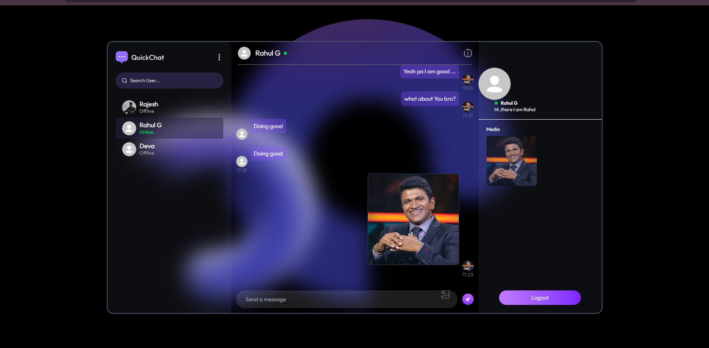
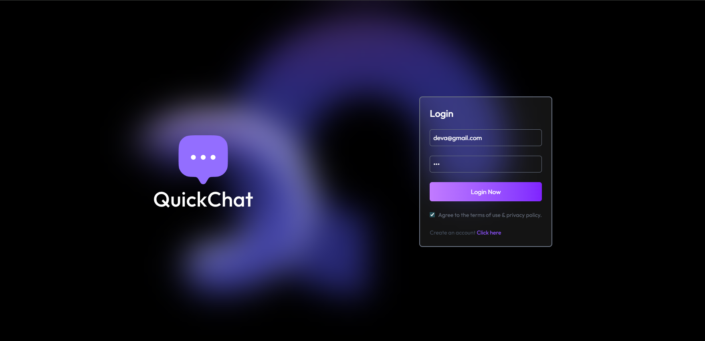

# 💬 ChatApp (MERN Stack)

A **MERN Stack real-time chat application** that combines the power of **MongoDB, Express, React (Vite), and Node.js**.  
It enables **secure authentication**, **real-time messaging** with **Socket.io**, and **media sharing** via **Cloudinary**.

[](https://chat-app-1-flax.vercel.app/)

Experience the app live here 👉 **[QuickChat Live](https://chat-app-1-flax.vercel.app)** 


🛠 Tech Stack

Frontend (Client)

React (Vite)

Context API / State Management

TailwindCSS (if enabled)

Backend (Server)

Node.js + Express

MongoDB + Mongoose

Socket.io (real-time events)

JWT + bcryptjs (auth & security)

Cloudinary (media storage)

-------
## ✨ Key Features
- 🔐 **Authentication & Authorization** – JWT-based login/register with encrypted passwords (bcryptjs)
- 💬 **Instant Messaging** – Real-time bidirectional communication with Socket.io
- 📸 **Media Uploads** – Cloudinary integration for storing images securely
- 📡 **REST APIs** – Structured Express routes for user & message management
- 🗄 **Database** – MongoDB + Mongoose for data persistence
- 🎨 **Modern Frontend** – React (Vite) with modular components and pages
- 🌍 **Cross-Origin Ready** – CORS enabled for smooth frontend-backend interaction
- ⚡ **Developer Friendly** – Nodemon support for backend hot reload
-----

## 📸 Snapshots  

### 🔑 Login Page  


### 💬 Chat Dashboard  
  

### 📤 Media Sharing  
  
````
## 📂 Project Structure
chatapp/
│── client/        # Frontend (React + Vite)
│   ├── src/
│   │   ├── assets/
│   │   ├── components/
│   │   ├── lib/
│   │   ├── pages/
│   │   ├── App.jsx
│   │   ├── index.css
│   │   └── main.jsx
│   ├── index.html
│   ├── package.json
│   └── vite.config.js
│
│── server/        # Backend (Node.js + Express + MongoDB)
│   ├── controllers/
│   ├── lib/
│   ├── middleware/
│   ├── models/
│   ├── routes/
│   ├── server.js
│   └── package.json
│
│── README.md
│── vercel.json


---

## ⚙️ Installation & Setup

### 1️⃣ Clone the Repository
```bash
git clone https://github.com/nagesh-makanapur/chat-app.git
cd chatapp
`````
**Create a .env file inside server/:**
PORT=5000
MONGO_URI=your_mongodb_connection_string
JWT_SECRET=your_jwt_secret
CLOUDINARY_CLOUD_NAME=your_cloud_name
CLOUDINARY_API_KEY=your_api_key
CLOUDINARY_API_SECRET=your_api_secret

Backend Setup (server)
```
cd server
npm install
````
Run backend:
````
npm start
npm run server
````
Frontend Setup (client)
```
cd ../client
npm install
npm run dev

```
Create a .env file inside client/:
VITE_SERVER_URL=http://localhost:5000


